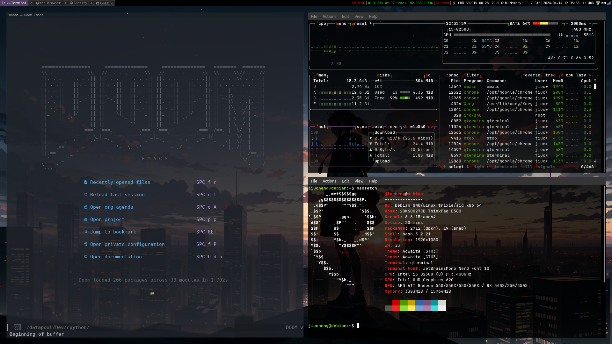
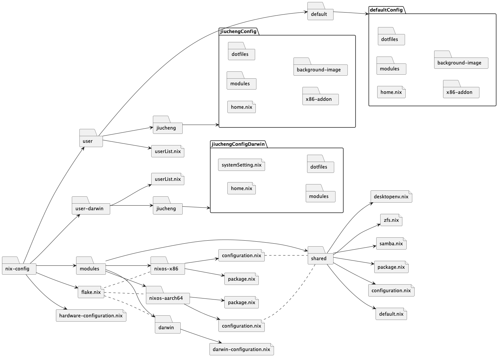

# Nix-config Reproducible System Design (MacOS-darwin & NixOS)

## Screenshot for Demo
**(Demo is based on Debian Version, and should be the roadmap to final Version of NixOS)**

## Current File/Dir Structure Design

