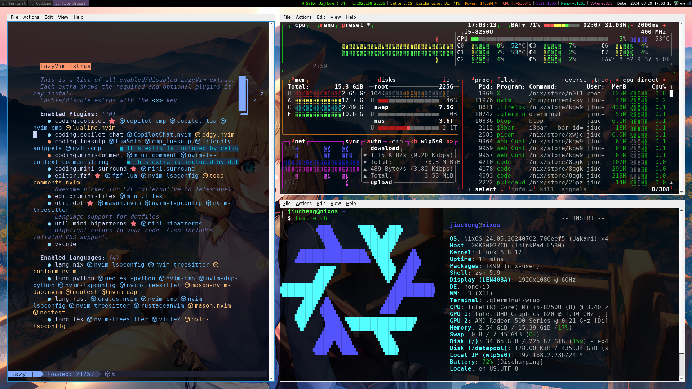
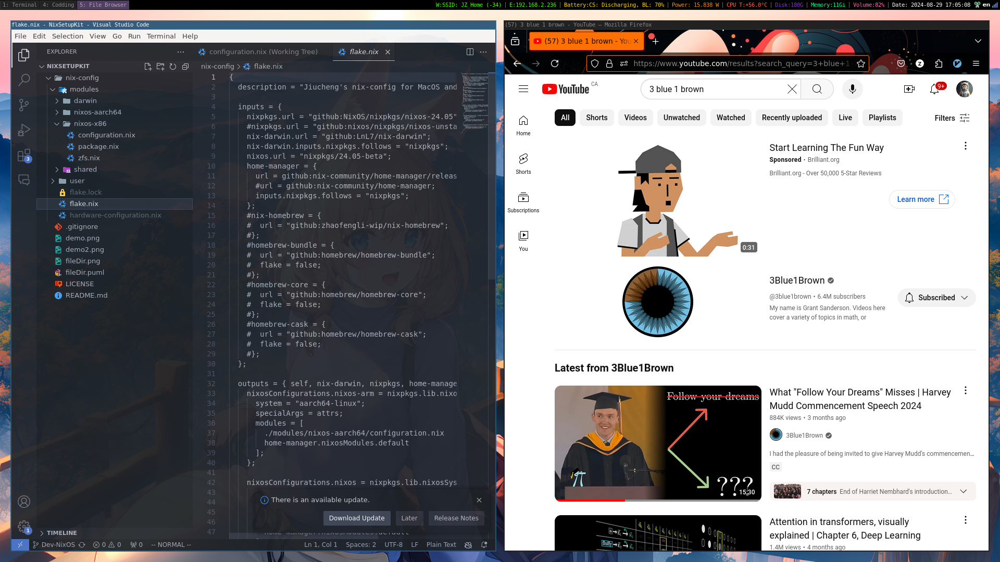

# NixSetupKit

NixSetupKit is a Nix-configured reproducible system design framework tailored for both macOS (Darwin) and NixOS. It enables users to set up a consistent and reproducible development environment across different systems.


## System Setup Details
### NixOS Setup
- Complete System Management: Manages the entire system configuration with zero side effects, ensuring a fully controlled and predictable environment.
### Darwin (macOS) Setup
- CLI Software Management: Focuses on managing command-line tools, streamlining your macOS development environment.

This setup creates a balance between macOS and NixOS, allowing you to maintain a consistent and efficient workflow, especially as a programmer needing to quickly set up a development environment.


## Features
- **Cross-Platform Support**: Works seamlessly on macOS and NixOS. (Based on [Flakes](https://nixos.wiki/wiki/Flakes))
- **Reproducible Environments**: Ensures consistent system configurations.
- **Modular Design**: Easily customizable for different project needs.
- **Fast Deployment**: Set up your environment in less than 5 minutes.

## Installation

1. Clone the repository:
    ```bash
    git clone https://github.com/zangjiucheng/NixSetupKit.git
    ```
2. Navigate to the project directory:
    ```bash
    cd NixSetupKit
    ```
3. Follow the setup instructions for your platform.
    - [**MacOS(Darwin)**](installation/macos.md)
    - [**Linux(NixOS)**](installation/nixos.md)


## Demo

**Desktop View**


**Programming Environment**


**File Browse and ZFS System**
<p>
    
    
</p>

**VM**
 


## <s>Current</s> File/Dir Structure Design (Not update anymore... Only overview scale)


## License
This project is licensed under the GPL-3.0 License.

## Contributing
Contributions are welcome! Please fork the repository and submit a pull request.